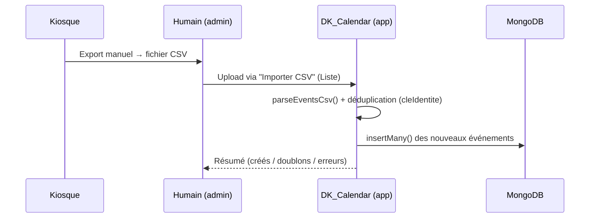
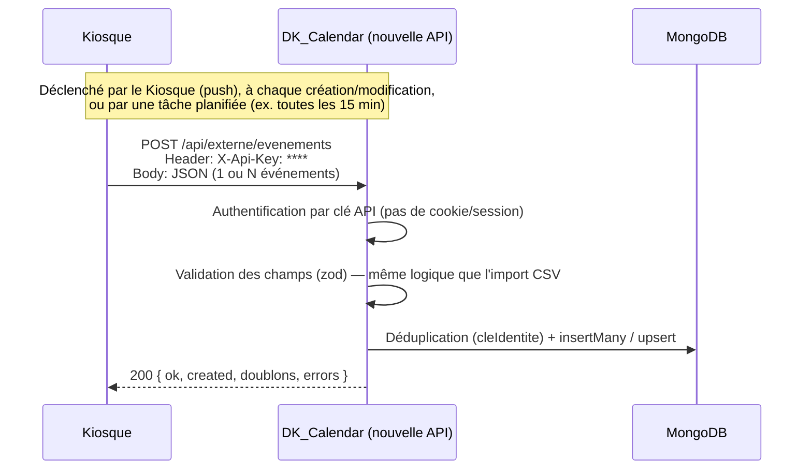

# Automatiser l'acquisition des données depuis le Kiosque — proposition d'architecture

> **Statut : document d'étude, rien n'est intégré.** Ce document explique comment on pourrait
> remplacer l'import manuel du fichier CSV par un flux automatique entre le Kiosque et
> DK_Calendar. Il contient du code d'exemple des deux côtés et indique précisément où ce code
> s'insérerait dans le projet actuel — mais aucun de ces fichiers n'existe encore dans le dépôt.
> À lire, discuter, puis à valider avant toute implémentation réelle.

## 1. Objectif

Aujourd'hui, un administrateur doit :
1. Exporter les événements du Kiosque en CSV
2. Se connecter à DK_Calendar
3. Aller dans **Liste → Importer CSV**
4. Choisir le fichier et lancer l'import

Le but est de supprimer les étapes 1 à 4 : dès qu'un événement est créé ou modifié côté Kiosque,
il apparaît automatiquement dans DK_Calendar, sans intervention humaine.

## 2. Flux actuel (rappel)



Point faible : tout dépend d'un humain qui pense à exporter et importer régulièrement — source
d'oublis et de décalage entre le Kiosque et le calendrier public.

## 3. Flux cible proposé



Le principe est le même que l'import CSV actuel (même déduplication par `cleIdentite`, mêmes
champs), seul le **transport** change : JSON via HTTP au lieu d'un fichier uploadé par un humain.

## 4. Contrat d'interface proposé

### Authentification

Le Kiosque n'est pas un utilisateur humain : pas de login, pas de cookie de session. On ajoute une
authentification par **clé API statique**, envoyée dans un en-tête HTTP, à distinguer du mécanisme
de session existant (`requireAuth` / `requireAdmin` dans `server/src/middleware/auth.ts`).

```
POST /api/externe/evenements HTTP/1.1
Host: dk-calendar.onrender.com
Content-Type: application/json
X-Api-Key: <clé secrète partagée, générée une fois, stockée côté Render ET côté Kiosque>
```

### Corps de la requête

Un objet unique, ou un tableau (pour envoyer plusieurs événements en un seul appel, comme le fait
déjà l'import CSV) :

```json
{
  "evenements": [
    {
      "eventId": "KIOSQUE-2026-00512",
      "nom": "Marché de Noël",
      "lieu": "Place Jean Bart",
      "quartier": "Dunkerque - Centre",
      "dateDeDebut": "2026-12-05",
      "dateDeFin": "2026-12-24",
      "pilote": "Mairie de Dunkerque",
      "directionPilote": "Direction Évènementiel",
      "organisateur": "Ville de Dunkerque",
      "nature": "Animation \"Grand Public\"",
      "niveau": "Municipal",
      "type": "Marché",
      "statut": "À valider"
    }
  ]
}
```

- `eventId` est fortement recommandé : c'est la clé d'identité la plus fiable (voir
  `cleIdentite()` dans `server/src/lib/identiteEvenement.ts`) — sans lui, la déduplication retombe
  sur `(nom, lieu, jour)`, ce qui marche mais est plus fragile si le Kiosque renomme un événement.
- Dates au format ISO (`AAAA-MM-JJ`), pas `JJ/MM/AAAA` comme le CSV — c'est le format JSON standard,
  pas d'ambiguïté jour/mois.
- Champs absents → mêmes valeurs par défaut que l'import CSV (`statut: "Brouillon"`, etc.)

### Réponse

```json
{ "ok": true, "created": 1, "updated": 0, "doublons": 0, "errors": [] }
```

## 5. Code côté Kiosque (exemple)

Exemple en Node.js (à adapter selon la techno réelle du Kiosque — le principe est le même en
Python, PHP, etc. : un simple appel HTTP POST) :

```js
// kiosque/export-vers-dk-calendar.js (CÔTÉ KIOSQUE — fichier à créer dans LEUR projet, pas le nôtre)

const DK_CALENDAR_URL = 'https://dk-calendar.onrender.com/api/externe/evenements';
const API_KEY = process.env.DK_CALENDAR_API_KEY; // fourni une seule fois par l'équipe DK_Calendar

async function envoyerEvenements(evenements) {
  const reponse = await fetch(DK_CALENDAR_URL, {
    method: 'POST',
    headers: {
      'Content-Type': 'application/json',
      'X-Api-Key': API_KEY,
    },
    body: JSON.stringify({ evenements }),
  });

  const resultat = await reponse.json();
  if (!reponse.ok || !resultat.ok) {
    console.error('[kiosque] Échec de la synchronisation DK_Calendar :', resultat);
    return;
  }
  console.log(`[kiosque] Synchronisé : ${resultat.created} créé(s), ${resultat.doublons} déjà connus`);
}

// Déclenchement possible :
// - juste après la création/modification d'un événement dans le Kiosque (push immédiat)
// - OU par une tâche planifiée (cron) toutes les N minutes, qui renvoie tout l'état courant
//   (la déduplication côté DK_Calendar absorbe les doublons sans problème)
```

Équivalent Python, si le Kiosque est plutôt sur cette stack :

```python
# kiosque/export_vers_dk_calendar.py (CÔTÉ KIOSQUE)
import os
import requests

DK_CALENDAR_URL = "https://dk-calendar.onrender.com/api/externe/evenements"
API_KEY = os.environ["DK_CALENDAR_API_KEY"]

def envoyer_evenements(evenements: list[dict]) -> None:
    reponse = requests.post(
        DK_CALENDAR_URL,
        json={"evenements": evenements},
        headers={"X-Api-Key": API_KEY},
        timeout=10,
    )
    resultat = reponse.json()
    if not reponse.ok or not resultat.get("ok"):
        print(f"[kiosque] Échec de la synchronisation : {resultat}")
        return
    print(f"[kiosque] Synchronisé : {resultat['created']} créé(s), {resultat['doublons']} déjà connus")
```

## 6. Code côté DK_Calendar (exemple) et positionnement dans le dépôt

Trois fichiers seraient concernés : un **nouveau** middleware d'authentification, une **nouvelle**
route, et une **modification** de `config.ts` + `index.ts` pour les brancher.

```
server/src/
├── config.ts                          (MODIFIÉ : + clé API du Kiosque)
├── index.ts                           (MODIFIÉ : + enregistrement de la nouvelle route)
├── middleware/
│   ├── auth.ts                        (existant, inchangé — sessions humaines)
│   └── apiKey.ts                      (NOUVEAU : authentification machine-à-machine)
├── routes/
│   ├── import.routes.ts               (existant, inchangé — upload CSV manuel, reste disponible)
│   └── api-externe.routes.ts          (NOUVEAU : réception des événements du Kiosque)
└── lib/
    ├── identiteEvenement.ts           (existant, réutilisé tel quel — cleIdentite())
    └── csv.ts                         (existant, non modifié)
```

### `server/src/config.ts` (ajout)

```ts
export const config = {
  // ... tout le reste inchangé ...
  kiosque: {
    apiKey: process.env.KIOSQUE_API_KEY, // undefined tant que la route n'est pas activée
  },
};
```

### `server/src/middleware/apiKey.ts` (nouveau)

```ts
import type { Request, Response, NextFunction } from 'express';
import { config } from '../config.js';

/**
 * Authentification machine-à-machine pour les appels du Kiosque : une clé statique dans l'en-tête
 * X-Api-Key, à ne pas confondre avec requireAuth/requireAdmin (sessions d'utilisateurs humains).
 */
export function requireApiKey(req: Request, res: Response, next: NextFunction): void {
  if (!config.kiosque.apiKey) {
    res.status(503).json({ ok: false, message: 'Intégration Kiosque non configurée' });
    return;
  }
  const cle = req.header('X-Api-Key');
  if (cle !== config.kiosque.apiKey) {
    res.status(401).json({ ok: false, message: 'Clé API invalide' });
    return;
  }
  next();
}
```

### `server/src/routes/api-externe.routes.ts` (nouveau)

```ts
import { Router } from 'express';
import { z } from 'zod';
import { EventModel } from '../models/Event.js';
import { requireApiKey } from '../middleware/apiKey.js';
import { cleIdentite } from '../lib/identiteEvenement.js';
import { consigner } from '../lib/journal.js';

export const apiExterneRouter = Router();

const evenementSchema = z.object({
  eventId: z.string().optional(),
  nom: z.string().min(1),
  lieu: z.string().optional(),
  quartier: z.string().optional(),
  dateDeDebut: z.string().optional(), // ISO "AAAA-MM-JJ"
  dateDeFin: z.string().optional(),
  pilote: z.string().optional(),
  directionPilote: z.string().optional(),
  organisateur: z.string().optional(),
  nature: z.string().optional(),
  niveau: z.string().optional(),
  type: z.string().optional(),
  statut: z.string().optional(),
});

const corpsSchema = z.object({
  evenements: z.array(evenementSchema).min(1),
});

/**
 * Réception des événements envoyés automatiquement par le Kiosque. Même principe de
 * déduplication que l'import CSV manuel (POST /api/import/evenements) : réutilise cleIdentite()
 * pour ne jamais écraser un événement déjà modifié dans l'application.
 */
apiExterneRouter.post('/evenements', requireApiKey, async (req, res) => {
  const parsed = corpsSchema.safeParse(req.body);
  if (!parsed.success) {
    res.status(400).json({ ok: false, message: 'Corps de requête invalide', details: parsed.error.issues });
    return;
  }

  const lignes = parsed.data.evenements.map((e) => ({
    eventId: e.eventId ?? '',
    nom: e.nom,
    lieu: e.lieu ?? '',
    quartier: e.quartier ?? '',
    dateDeDebut: e.dateDeDebut ? new Date(e.dateDeDebut) : null,
    dateDeFin: e.dateDeFin ? new Date(e.dateDeFin) : null,
    pilote: e.pilote ?? '',
    directionPilote: e.directionPilote ?? '',
    organisateur: e.organisateur ?? '',
    nature: e.nature ?? '',
    niveau: e.niveau ?? '',
    type: e.type ?? '',
    statut: e.statut || 'Brouillon',
  }));

  const existants = await EventModel.find({}, { eventId: 1, nom: 1, lieu: 1, dateClef: 1, dateDeDebut: 1 }).lean();
  const clesExistantes = new Set(existants.map(cleIdentite));

  const aCreer = lignes.filter((l) => !clesExistantes.has(cleIdentite(l)));

  if (aCreer.length > 0) {
    await EventModel.insertMany(aCreer, { ordered: false });
  }

  await consigner(
    { type: 'api-kiosque' }, // à adapter : identiteDeRequete() suppose une session humaine
    'import_evenements_api',
    `${aCreer.length} créé(s) via l'API Kiosque`,
    { created: aCreer.length }
  );

  res.json({ ok: true, created: aCreer.length, doublons: lignes.length - aCreer.length, errors: [] });
});
```

### `server/src/index.ts` (ajout, à côté des routes existantes)

```ts
import { apiExterneRouter } from './routes/api-externe.routes.js';
// ...
app.use('/api/externe', apiExterneRouter); // à ajouter sous la ligne app.use('/api/import', importRouter);
```

### Variable d'environnement à ajouter sur Render (`render.yaml`)

```yaml
      - key: KIOSQUE_API_KEY
        generateValue: true   # Render génère une valeur aléatoire, à communiquer ensuite au Kiosque
```

## 7. Sécurité

- **HTTPS obligatoire** : déjà garanti, Render ne sert qu'en HTTPS.
- **Clé API secrète**, générée une fois côté Render, communiquée au Kiosque par un canal sûr (jamais
  par email en clair) ; à régénérer si elle fuite (même logique que le mot de passe MongoDB).
- **Validation stricte** du corps de requête (zod) : contrairement à l'import CSV (plus tolérant car
  pensé pour des fichiers Excel imparfaits), une API peut se permettre d'être stricte et de rejeter
  clairement une requête mal formée (400) plutôt que de deviner.
- **Pas de suppression possible via cette route** : volontairement, l'API ne fait que créer — jamais
  modifier ni supprimer un événement existant, pour qu'une anomalie côté Kiosque ne puisse jamais
  écraser une validation déjà faite dans DK_Calendar (même principe de protection que l'import CSV
  actuel).
- Envisager un **rate limit** sur cette route (le projet utilise déjà `express-rate-limit` pour la
  connexion) si le Kiosque pousse très fréquemment.

## 8. Ce qui ne change pas

- Le bouton **Importer CSV** reste disponible : l'API est un canal supplémentaire, pas un
  remplacement forcé — utile en secours si le Kiosque est en panne, ou pendant la phase de mise au
  point du nouveau flux.
- Aucun champ, aucune règle de déduplication, aucun modèle de données ne change : l'API réutilise
  exactement la même logique (`cleIdentite`) que l'import CSV existant.

## 9. Étapes pour une intégration réelle (quand vous serez prêts)

1. Valider le format exact des champs avec l'équipe Kiosque (quels champs ils peuvent réellement
   fournir, quel `eventId` ils utilisent en interne).
2. Décider du mode de déclenchement : push immédiat à chaque modification, ou synchronisation
   périodique (cron côté Kiosque).
3. Créer les 3 fichiers ci-dessus dans le dépôt, écrire des tests, générer la clé API sur Render.
4. Tester en local avec `curl` avant de brancher le vrai Kiosque.
5. Une fois validé, documenter la clé API et l'URL pour l'équipe Kiosque (même type de document que
   `docs/DEPLOIEMENT-CUD.md`).
